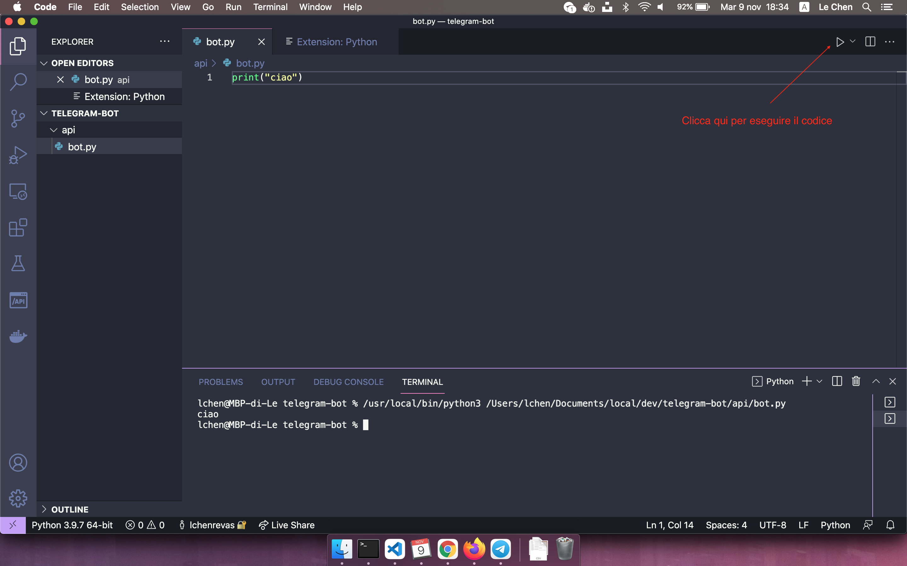

# 01-crea-prima-istruzione-python

| Capitolo precedente                                                                                                                                          | Capitolo successivo                                                                           |
| :--------------------------------------------------------------------------------------------------------------------------------------------------------------- | ---------------------------------------------------------------------------------------------------: |
| [◀︎ 00-installazione](../00-installazione)  | [02-crea-prima-funzione ▶︎](../02-crea-prima-funzione) |

## Obiettivo

Crea il tuo primo comando in Python. Possiamo scrivere una semplice comando che stampi la parola "ciao".

## Steps

#### 1. Setup progetto
- Crea una cartella chiamata `bot-telegram` sul tuo computer
- Dentro questa cartella creane un'altra chiamata `api`
- Dentro `api` crea un file chiamato `bot.py`
- Installa l'estensione suggerita dall'editor per farlgi riconoscere i file in Python

Struttura
 - bot-telegram
    - api
       - bot.py

#### 2. Scrivi il comando
- All'interno del file `bot.py` scrivi il seguente codice `print("ciao")`

#### 3. Esegui il comando
- Esegui il comando cliccando "play" in alto a destra
- Si aprirà un terminale con la scritta "ciao"
- Hai creato il tuo primo comando in Python!

<kbd></kbd>

| Capitolo precedente                                                                                                                                          | Capitolo successivo                                                                           |
| :--------------------------------------------------------------------------------------------------------------------------------------------------------------- | ---------------------------------------------------------------------------------------------------: |
| [◀︎ 00-installazione](../00-installazione)  | [02-crea-prima-funzione ▶︎](../02-crea-prima-funzione) |