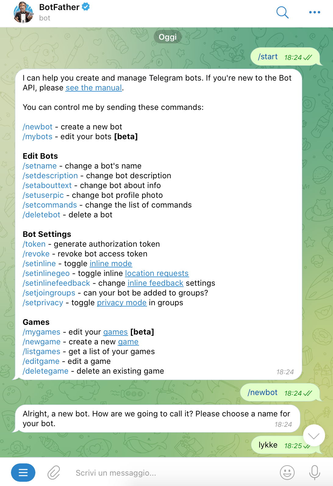
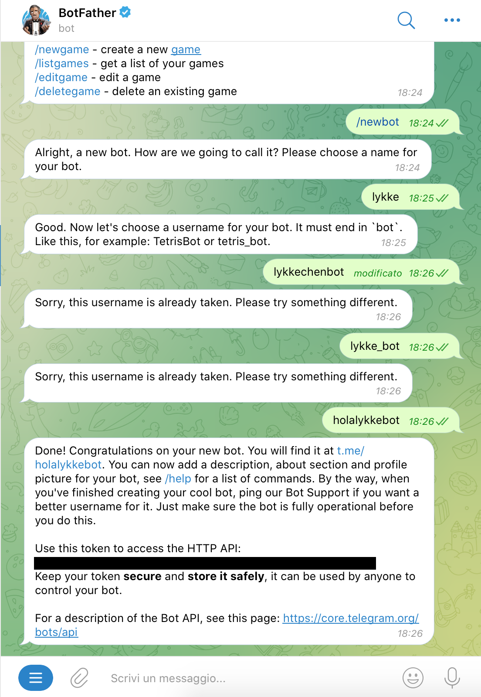

# 01-creazione-bot

|    | Capitolo successivo | 
|:-- | ------------------: |
| [◀︎ Introduzione](https://github.com/voxel-community/2021-telegram-nasa-bot/) | [01-creazione-bot ▶︎]() |

## Obiettivo

Il primo compito è quello di creare un bot Telegram con cui gli utenti potranno interagire. Per farlo parleremo con il Botfather, il padre di tutti i bot. Questo è un bot speciale di Telegram per creare nuovi bot e aggiornarli. 

## Steps

#### 1. Comincia una nuova chat con Botfather
- Puoi farlo cercando Botfather da Telegram oppure cliccando su questo link [https://t.me/botfather](https://t.me/botfather) 

#### 2. Chiedi a Botfather di creare nuovo bot
- Scrivi a Botfather `/newbot`
- Inserisci il nome del bot e uno username

<kbd></kbd>

#### 3. Ottieni il codice per mandare richieste al bot
- Userai questo codice in uno step successivo. Tieni questo codice al sicuro e non condividerlo con nessuno.

<kbd></kbd>

|    | Capitolo successivo | 
|:-- | ------------------: |
| [◀︎ Introduzione](https://github.com/voxel-community/2021-telegram-nasa-bot/) | [01-creazione-bot ▶︎]() |