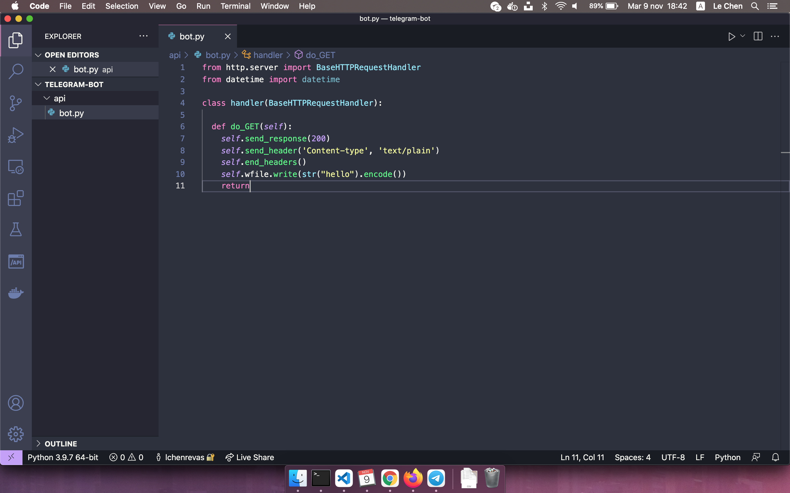
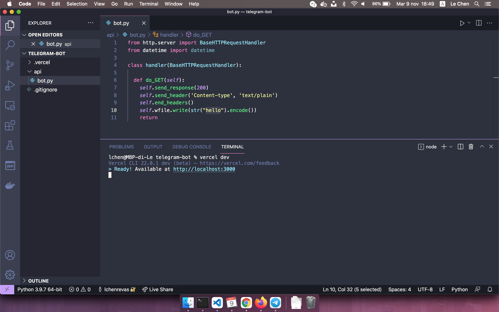
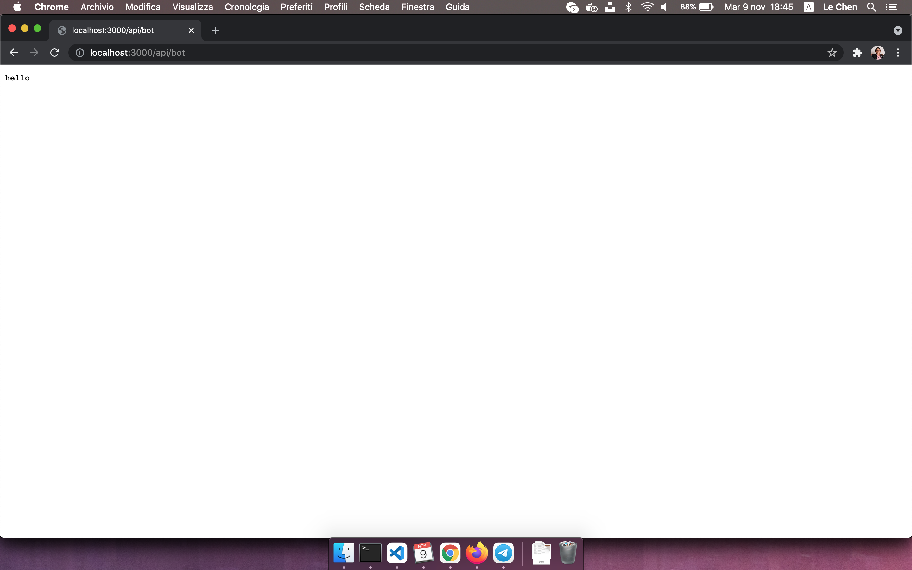
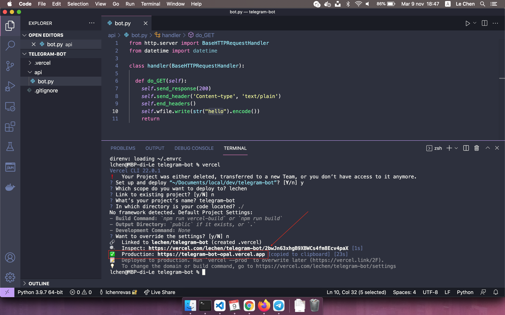
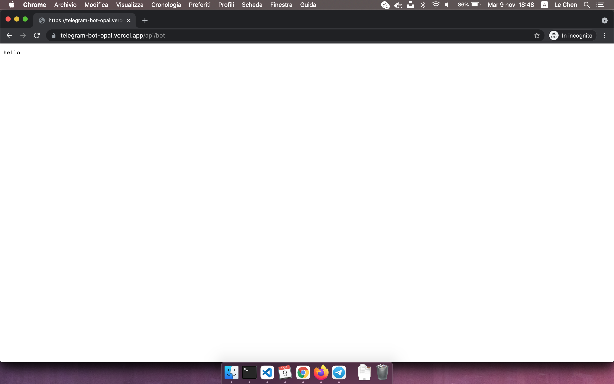

# 02-crea-prima-funzione

| Capitolo precedente                                                                                                                                          | Capitolo successivo                                                                           |
| :--------------------------------------------------------------------------------------------------------------------------------------------------------------- | ---------------------------------------------------------------------------------------------------: |
| [◀︎ 01-crea-prima-istruzione-python](../01-crea-prima-istruzione-python)  | [03-crea-bot ▶︎](../03-crea-bot) |

## Obiettivo

Crea una semplice funzione che risponde "hello".

In questo capitolo lavoreremo con [Vercel](https://vercel.com/), una piattaforma che ti permette di pubblicare siti web e funzioni serverless. Le [funzioni serverless](https://vercel.com/docs/concepts/functions/supported-languages#python), che sono pezzi di codice scritte con linguaggi di backend che accettano una richiesta HTTP (richiesta web) e forniscono una risposta.

Con serverless si intende un modello di servizio cloud dove il provider, in questo caso Vercel, alloca le risorse appena queste vengono richieste. Quando un app non è in uso, nessuna risorsa viene consumata. Il termine serverless è fuorviante perché sono comunque utilizzati dei server in cloud, ma questi vengono astratti ai programmatori, che non devono più occuparsene.

## Steps

#### 1. Scrivi la funzione

- Inserisci il seguente codice al posto di `print("ciao")`
``` py
from http.server import BaseHTTPRequestHandler

class handler(BaseHTTPRequestHandler):

  def do_GET(self):
    self.send_response(200)
    self.send_header('Content-type', 'text/plain')
    self.end_headers()
    self.wfile.write(str("hello").encode())
    return
```

<kbd></kbd>

#### 2. Simula un server

Per provare la tua funzione senza metterla online puoi testarla simulando un server sul tuo pc
- Apri il terminale e fai login su Vercel con questo comando 
```
vercel login
```
- Avvia un server locale (sul tuo computer e non su internet) con questo comando 

```
vercel dev
```

Hai appena avviato un piccolo server sul tuo pc al seguente link `http://localhost:3000`

<kbd></kbd>

#### 3. Invoca la funzione dal tuo computer
> Vercel sa automaticamente che i file all'interno della cartella `api` sono delle funzioni serverless. 

- Per chiamare la funzione apri il tuo browser e vai all'url `http://localhost:3000/api/bot` 

>`bot` corrisponde al nome dei file

<kbd></kbd>

#### 3. Metti online la funzione
- Per pubblicare online la funzione creata basta eseguire questo comando
```
vercel --prod
```

<kbd></kbd>

#### 3. Invoca la funzione su internet

- Per chiamare la funzione apri il tuo browser e vai all'url `https://{URL_DI_VERCEL}/api/bot` 

> `bot` corrisponde al nome dei file

<kbd></kbd>

| Capitolo precedente                                                                                                                                          | Capitolo successivo                                                                           |
| :--------------------------------------------------------------------------------------------------------------------------------------------------------------- | ---------------------------------------------------------------------------------------------------: |
| [◀︎ 01-crea-prima-istruzione-python](../01-crea-prima-istruzione-python)  | [03-crea-bot ▶︎](../03-crea-bot) |