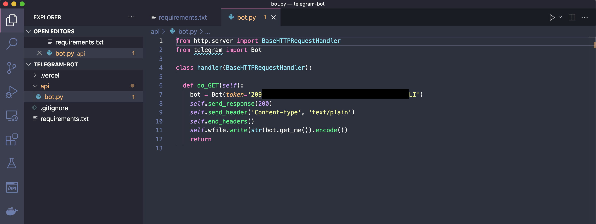

# 04-colleghiamo-funzione-a-telegram

|    | Capitolo successivo | 
|:-- | ------------------: |
| [◀︎ Introduzione](https://github.com/voxel-community/2021-telegram-nasa-bot/) | [01-creazione-bot ▶︎]() |

## Obiettivo

Collega la tua funzione alle API di Telegram. Faremo un piccolo test andando a chiedere a Telegram le informazioni sul bot.

## Steps

#### 1. Modifica la funzione

- Inserisci il seguente codice
``` py
from http.server import BaseHTTPRequestHandler
from telegram import Bot

class handler(BaseHTTPRequestHandler):

  def do_GET(self):
    bot = Bot(token='TOKEN_TELEGRAM_BOT')
    res = bot.setWebhook(url)
    self.send_response(200)
    self.send_header('Content-type', 'text/plain')
    self.end_headers()
    self.wfile.write(str(bot.get_me()).encode())
    return
```

- Sostituisci `TOKEN_TELEGRAM_BOT` con il codice ricevuto prima dal Botfather

<kbd></kbd>

#### 2. Crea un file per riuscire ad utilizzare le API di Telegram

- Dentro la cartella del progetto, `telegram-bot` crea un file con nome `requirements.txt`

- All'interno del file inserisci il seguente testo

```
python-telegram-bot==13.7
```

#### 3. Invoca la funzione dal tuo computer

- Come prima, per testare la funzione sul tuo pc, chiudi il server con i tasti `ctrl + c` sul terminale e riavvialo con il comando
```
vercel dev
```

- Per chiamare la funzione apri il tuo browser e vai all'url `http://localhost:3000/api/bot` (`bot` corrisponde al nome dei file)

<kbd></kbd>

#### 3. Metti online la funzione
- Per pubblicare online la funzione creata basta eseguire questo comando
```
vercel --prod
```

#### 3. Invoca la funzione su internet

- Per chiamare la funzione apri il tuo browser e vai all'url `https://{URL_DI_VERCEL}/api/bot` 

<kbd></kbd>

|    | Capitolo successivo | 
|:-- | ------------------: |
| [◀︎ Introduzione](https://github.com/voxel-community/2021-telegram-nasa-bot/) | [01-creazione-bot ▶︎]() |