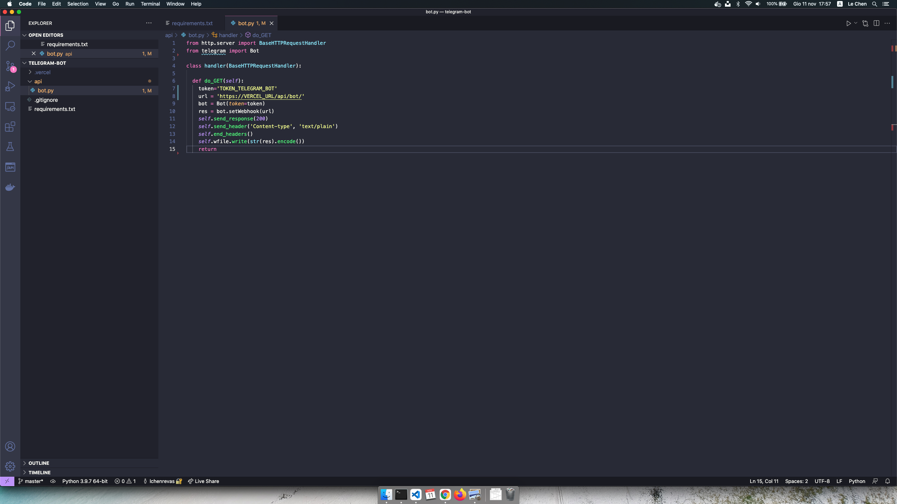

# 05-registrazione-webhook

| Capitolo precedente                                                                                                                                          | Capitolo successivo                                                                           |
| :--------------------------------------------------------------------------------------------------------------------------------------------------------------- | ---------------------------------------------------------------------------------------------------: |
| [◀︎ 04-colleghiamo-funzione-a-telegram](../04-colleghiamo-funzione-a-telegram)  | [06-bot-asteroide ▶︎](../06-bot-asteroide) |

## Obiettivo

Ora il gioco si scalda, finora abbiamo creato una funzione che va a comunicare direttamente con le API di Telegram. Ma come facciamo a far comunicare il bot con la nostra funzione? Un modo è quello di mandare continue richieste alle API di Telegram per vedere se qualche utente ha interagito con il bot oppure puoi registrare un WebHook per essere automaticamente avvisata una volta che le richieste siano disponibili. Quest'ultima è la soluzione migliore e più efficiente.

Cos'è un webhook?

In poche parole: i webhook consentono alle app di comunicare automaticamente tra loro.
Ecco alcuni esempi:
- MailChimp utilizza un webhook per iscrivere gli utenti del tuo sito web alla tua newsletter.
- Paypal lo usa per dire alla tua app di contabilità quando i tuoi clienti ti pagano.

I webhook sono fondamentalmente piccoli frammenti di codice collegati a un'applicazione web che vengono attivati ​​da eventi specifici. Nel nostro caso vogliamo sapere quando un utente interagisce con il nostro bot. Quindi ad ogni interazione vogliamo che il webhook mandi un evento alla nostra funzione per avvisarla.

## Steps

#### 1. Creare funzione per registrare webhook

Se non colleghiamo direttamente il bot alla funzione dobbiamo far sapere al webhook di Telegram dove si trova la nostra funzione e quindi dove mandare gli eventi. Dobbiamo quindi registrare l'url della nostra funzione al webhook di Telegram.

- Inserisci il seguente codice
``` py
from http.server import BaseHTTPRequestHandler
from telegram import Bot

class handler(BaseHTTPRequestHandler):

  def do_GET(self):
    token='TOKEN_TELEGRAM_BOT'
    url = 'https://VERCEL_URL/api/bot/'
    bot = Bot(token=token)
    res = bot.setWebhook(url)
    self.send_response(200)
    self.send_header('Content-type', 'text/plain')
    self.end_headers()
    self.wfile.write(str(res).encode())
    return
```

- Sostituisci `TOKEN_TELEGRAM_BOT` con il codice ricevuto prima dal Botfather
- Sostituisci `VERCEL_URL` con l'url che ti ha dato Vercel

<kbd></kbd>

#### 2. Metti online la funzione per registrare il webhook

- Per pubblicare online la funzione creata basta eseguire questo comando
```
vercel --prod
```

#### 3. Invoca la funzione su internet

- Per chiamare la funzione apri il tuo browser e vai all'url `https://{URL_DI_VERCEL}/api/bot`
> Questa operazione va fatta una sola volta, dovrà essere rifatta solo nel caso di cambio l'url.

#### 4. Verifica registrazione

Puoi verificare che la registrazione ha avuto successo andando al seguente link: https://api.telegram.org/{TOKEN_TELEGRAM_BOT}/getWebhookInfo

| Capitolo precedente                                                                                                                                          | Capitolo successivo                                                                           |
| :--------------------------------------------------------------------------------------------------------------------------------------------------------------- | ---------------------------------------------------------------------------------------------------: |
| [◀︎ 04-colleghiamo-funzione-a-telegram](../04-colleghiamo-funzione-a-telegram)  | [06-bot-asteroide ▶︎](../06-bot-asteroide) |