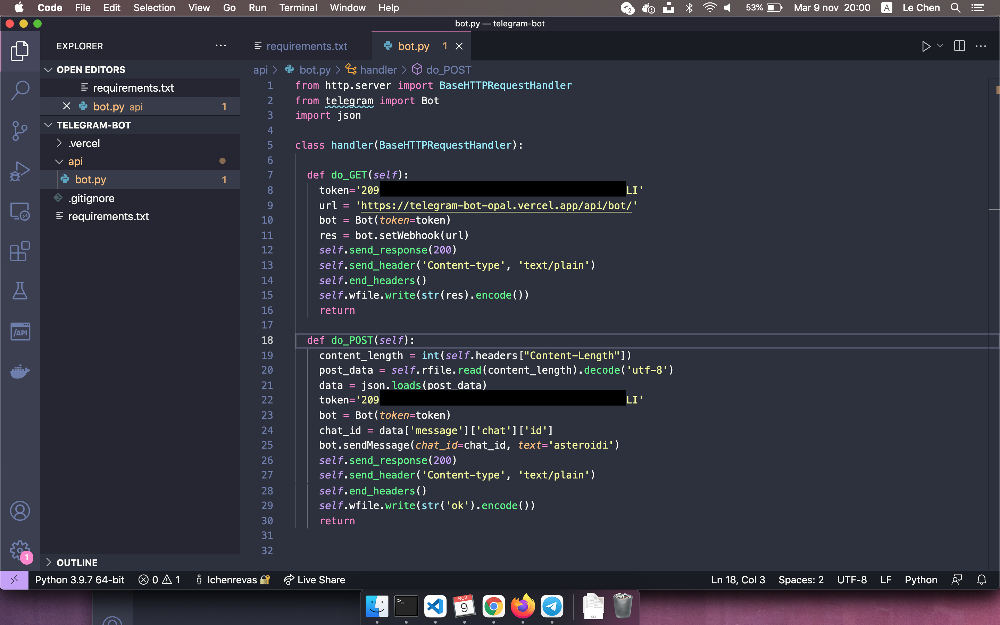
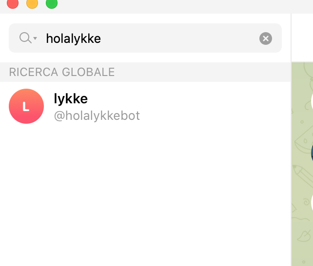
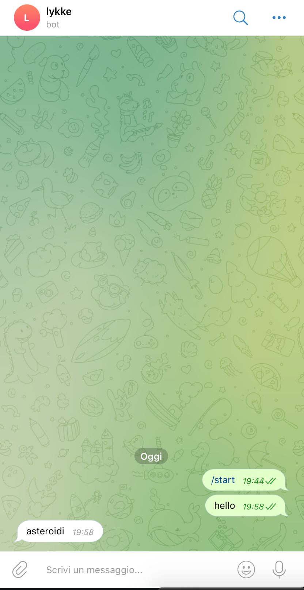

# 06-bot-asteroide

| Capitolo precedente                                                                                                                                          | Capitolo successivo                                                                           |
| :--------------------------------------------------------------------------------------------------------------------------------------------------------------- | ---------------------------------------------------------------------------------------------------: |
| [◀︎ 05-registrazione-webhook](../05-registrazione-webhook)  | [07-bot-nasa ▶︎](../07-bot-nasa) |

## Obiettivo

In questo capitolo vogliamo fare in modo che qualsiasi cosa scriva un utente scriva al bot, il bot risponda con "asteroide"

## Steps

#### 1. Funzione Post chiama API NASA

- Inserisci il seguente codice
``` py
from http.server import BaseHTTPRequestHandler
from telegram import Bot

class handler(BaseHTTPRequestHandler):

  def do_GET(self):
    token='TOKEN_TELEGRAM_BOT'
    url = 'https://VERCEL_URL/api/bot/'
    bot = Bot(token=token)
    res = bot.setWebhook(url)
    self.send_response(200)
    self.send_header('Content-type', 'text/plain')
    self.end_headers()
    self.wfile.write(str(res).encode())
    return

  def do_POST(self):
    token='TOKEN_TELEGRAM_BOT'
    bot = Bot(token=token)
    bot.sendMessage(chat_id=chat_id, text="asteroide")
    self.send_response(200)
    self.send_header('Content-type', 'text/plain')
    self.end_headers()
    self.wfile.write(str('ok').encode())
    return


```

- Sostituisci `TOKEN_TELEGRAM_BOT` con il codice ricevuto prima dal Botfather
- Sostituisci `VERCEL_URL` con l'url che ti ha dato Vercel

<kbd></kbd>

#### 2. Metti online la funzione per registrare il webhook

- Per pubblicare online la funzione creata basta eseguire questo comando
```
vercel --prod
```

#### 3. Trova il tuo bot
- Da cellulare o web entra su Telegram e cerca il bot creato tramite username

<kbd></kbd>

#### 4. Vai a chattare con il tuo bot
- Manda un qualsiasi messaggio
<kbd></kbd>


| Capitolo precedente                                                                                                                                          | Capitolo successivo                                                                           |
| :--------------------------------------------------------------------------------------------------------------------------------------------------------------- | ---------------------------------------------------------------------------------------------------: |
| [◀︎ 05-registrazione-webhook](../05-registrazione-webhook)  | [07-bot-nasa ▶︎](../07-bot-nasa) |