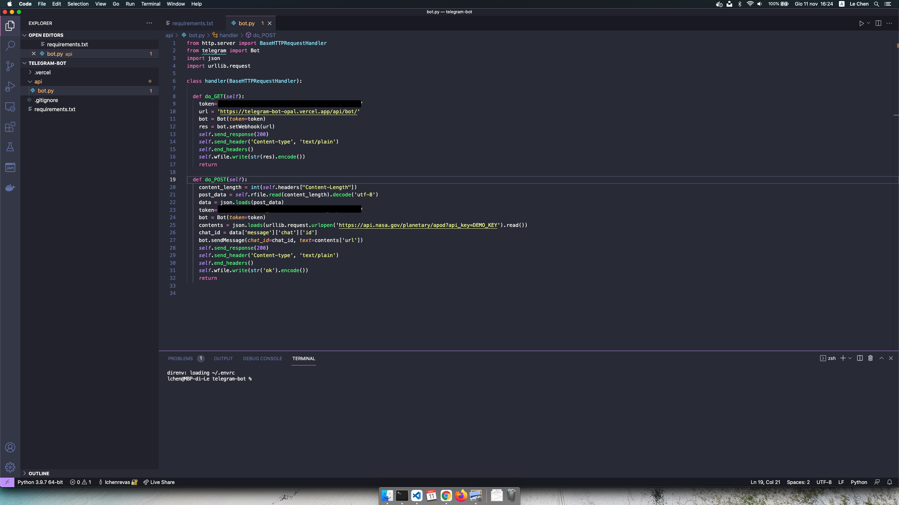
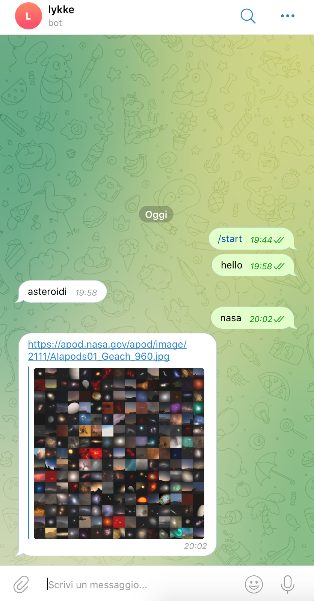

# 05-colleghiamo-funzione-webhook

|    | Capitolo successivo | 
|:-- | ------------------: |
| [◀︎ Introduzione](https://github.com/voxel-community/2021-telegram-nasa-bot/) | [01-creazione-bot ▶︎]() |

## Obiettivo

Sei arrivata al capitolo finale, finalmente collegheremo la nostra funzione alle API della NASA.

## Steps

#### 1. Funzione Post chiama API Nasa

Scriviamo un altra funzione, questa volta sarà una richiesta POST dove il bot risponse sempre con "asteroide"

- Inserisci il seguente codice
``` py
from http.server import BaseHTTPRequestHandler
from telegram import Bot
import json
import urllib.request

class handler(BaseHTTPRequestHandler):

  def do_GET(self):
    token='2098310578:AAGI_PIk5k-BJ0IIGeGhFzJSj98psBwURLI'
    url = 'https://telegram-bot-opal.vercel.app/api/bot/'
    bot = Bot(token=token)
    res = bot.setWebhook(url)
    self.send_response(200)
    self.send_header('Content-type', 'text/plain')
    self.end_headers()
    self.wfile.write(str(res).encode())
    return

  def do_POST(self):
    content_length = int(self.headers["Content-Length"])
    post_data = self.rfile.read(content_length).decode('utf-8')
    data = json.loads(post_data)
    token='2098310578:AAGI_PIk5k-BJ0IIGeGhFzJSj98psBwURLI'
    bot = Bot(token=token)
    contents = json.loads(urllib.request.urlopen('https://api.nasa.gov/planetary/apod?api_key=DEMO_KEY').read())
    chat_id = data['message']['chat']['id']
    bot.sendMessage(chat_id=chat_id, text=contents['url'])
    self.send_response(200)
    self.send_header('Content-type', 'text/plain')
    self.end_headers()
    self.wfile.write(str('ok').encode())
    return


```

- Sostituisci `TOKEN_TELEGRAM_BOT` con il codice ricevuto prima dal Botfather

<kbd></kbd>

#### 2. Metti online la funzione per registrare il webhook

- Per pubblicare online la funzione creata basta eseguire questo comando
```
vercel --prod
```

#### 3. Vai a chattare con il tuo bot
- Manda un qualsiasi messaggio
<kbd></kbd>


|    | Capitolo successivo | 
|:-- | ------------------: |
| [◀︎ Introduzione](https://github.com/voxel-community/2021-telegram-nasa-bot/) | [01-creazione-bot ▶︎]() |