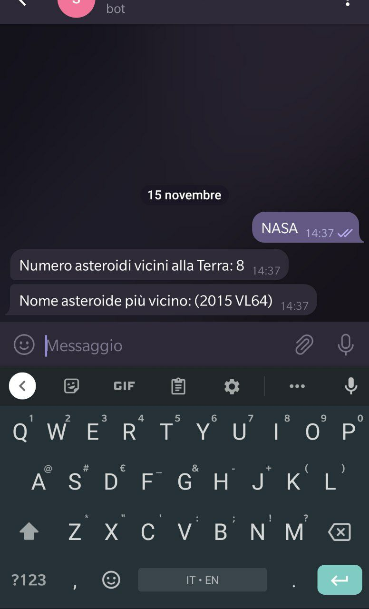

# Asteroide più vicino

## Obiettivo

Modificare la risposta del bot, andando a prendere i dati attuali degli asteroidi più vicini alla terra in questo momento che vengono forniti da una diversa API della NASA.

## Steps

### 1. Funzione Post chiama API Nasa per ottenere asteroidi vicini

Per ottenere i dati degli asteroidi vicini, va chiamata una diversa API.
Modifica il file `bot.py` con il seguente codice.

``` py
from http.server import BaseHTTPRequestHandler
from telegram import Bot
import json
import urllib.request
from datetime import datetime

class handler(BaseHTTPRequestHandler):
  def do_GET(self):
    token='TOKEN_TELEGRAM_BOT'
    url = 'https://VERCEL_URL/api/bot/'
    bot = Bot(token=token)
    res = bot.setWebhook(url)
    self.send_response(200)
    self.send_header('Content-type', 'text/plain')
    self.end_headers()
    self.wfile.write(str(res).encode())
    return
  
  def do_POST(self):
    content_length = int(self.headers["Content-Length"])
    post_data = self.rfile.read(content_length).decode('utf-8')
    data = json.loads(post_data)
    chat_id = data['message']['chat']['id']
    token='TOKEN_TELEGRAM_BOT'
    bot = Bot(token=token)
    start_date=str(datetime.now().strftime('%Y-%m-%d'))
    url_obj="https://api.nasa.gov/neo/rest/v1/feed?start_date=%s&end_date=%s&api_key=DEMO_KEY" % (start_date, start_date)
    response = json.loads(urllib.request.urlopen(url_obj).read())
    element_count=response['element_count']
    counter="Numero asteroidi vicini alla Terra: %s" % element_count
    bot.sendMessage(chat_id=chat_id, text=counter)
    nearest_object=response['near_earth_objects'][start_date][0]['name']
    name="Nome asteroide più vicino: %s" % nearest_object
    self.send_header('Content-type', 'text/plain')
    bot.sendMessage(chat_id=chat_id, text=name)
    self.send_response(200)
    self.end_headers()
    self.wfile.write(str('ok').encode())
    return

```

- Sostituisci TOKEN_TELEGRAM_BOT con il codice ricevuto prima dal Botfather
- Sostituisci VERCEL_URL con l'url che ti ha dato Vercel  

### 2. Metti online la funzione per registrare il webhook

- Per pubblicare online la funzione creata basta eseguire questo comando
```
vercel --prod
```

### 3. Vai a chattare con il tuo bot
- Manda un qualsiasi messaggio al tuo bot
<kbd></kbd>